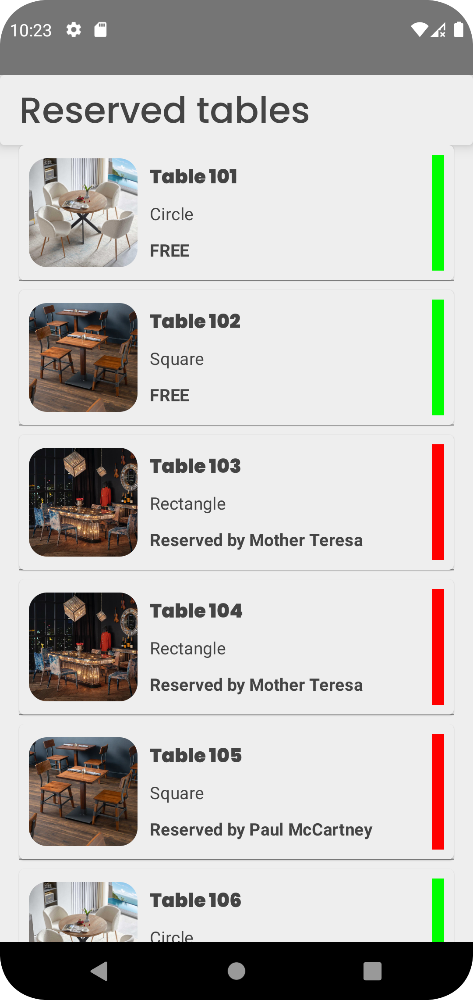
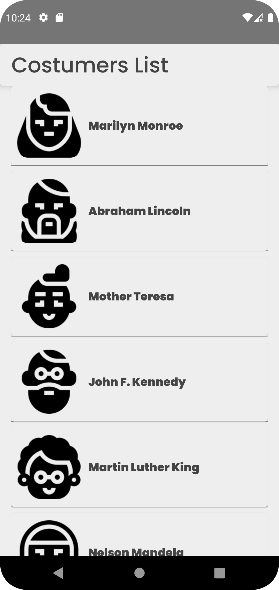
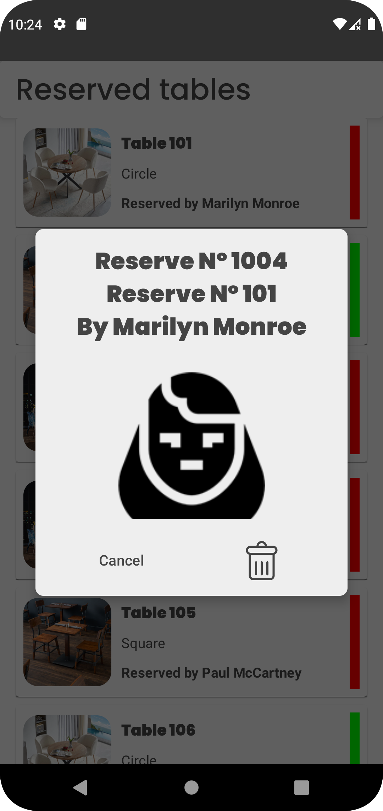

# Mobile Android Engineer Coding Challenge

# Restaurant Reservation App

This project is a restaurant reservation application built using Kotlin and Jetpack Compose. It follows Clean Architecture principles and features a layered architecture, separating concerns into domain, data, and presentation layers. The first thing that was worked on was the architecture, transitioning entirely to Compose. This brought about some issues that were resolved, such as outdated Gradle versions, as well as dependencies and plugins.

egarding the architecture, Clean Architecture and Layered Feature were used. A domain layer was created for the business logic, a data layer for the implementation of interfaces and external connections, and a presentation layer for the UI where all the composables are located. Furthermore, this is separated by feature, in this case, reservations. This app is designed to continue growing.

Imagine we want to add a new feature for online orders or customer service. It would be as simple as adding a new module with the name of the feature and within it, create the separation that Clean Architecture recommends (presenter - data - domain).

## Architecture
- **Domain Layer**: Contains the business logic of the application, including entities, use cases, and repository interfaces.
- **Data Layer**: Implements the repository interfaces defined in the domain layer. It handles data retrieval and manipulation, including API calls and database operations.
- **Presentation Layer**: Handles the UI components of the application, implemented using Jetpack Compose. It includes screens, composables, and view models.

## Features
- **Reservation List**: Displays a list of tables, indicating their availability. Green indicates an available table, while red indicates a reserved table.
- **Table Reservation**: Allows users to reserve a table by selecting a customer to assign to the table.
- **Reservation Deletion**: Provides the ability to delete a reservation, updating the table's status accordingly.
- **Offline Support**: Utilizes caching to store data retrieved from the API, allowing offline access to reservation information.

## Architecture
The project follows Clean Architecture principles, promoting separation of concerns and maintainability. The layers are organized as follows:
- **Domain Layer**: Contains business logic independent of external dependencies.
- **Data Layer**: Implements data access and manipulation logic, interacting with external data sources.
- **Presentation Layer**: Handles UI logic and user interactions, using Jetpack Compose for declarative UI development.

## Future Improvements
- **Core module**: Create a CORE module for strings so that we can use String Resource throughout the application.
- **View Model Unit Test**: Add more Unit tests for the View models

## Contributing
Contributions are welcome! If you have any suggestions, bug fixes, or feature requests, please let me know.

